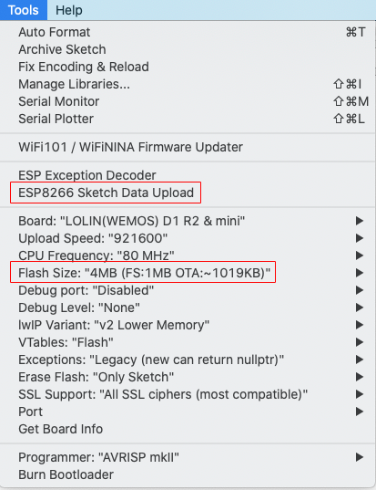
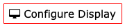
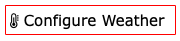
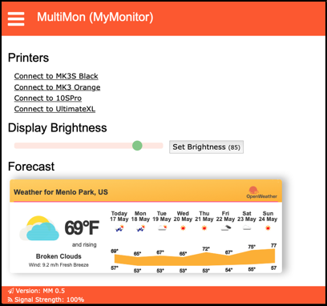

# Marquee: Scrolling Display of Useful Information

*Marquee* is a device that can display weather, 3D Printer status, messages, and other information on a monochrome LED Matrix panel. It is based on the [WebThingApp library](https://github.com/jpasqua/WebThingApp), which itself is based on the [WebThing library](https://github.com/jpasqua/WebThing) library. To understand how those libraries work in more detail, refer to their documentation.

This project was inspired by the [marquee-scroller](https://github.com/Qrome/marquee-scroller) project by [Qrome](https://github.com/Qrome). I don't believe there is any shared code, but you will certainly notice a lot of similarity in functionality and look & feel. Thank you to Qrome.

*Marquee* has the notion of "screens" of information. There is a Home screen that displays the time and temperature, a Weather screen that displays current weather conditions, a Forecast screen, a "Message of the Day" screen, and so on. These screens are displayed in a user selectable order. For the most part the screens scroll information across the display.

Many of the screens can be configured to select what information is shown (e.g. show wind direction, but not barometric pressure) and in what order the information should be shown (e.g. show temperature first, then wind speed, then a description). All of this configuration is performed in the Web UI.

## Dependencies

### Libraries

To build this application you will need to douwnload and install all of the libraries required by [WebThingApp library](https://github.com/jpasqua/WebThingApp) and [WebThing library](https://github.com/jpasqua/WebThing). At the time of this writing, those libraries are:

* [Adafruit_NeoPixel](https://github.com/adafruit/Adafruit_NeoPixel): 1.7.0
* [Arduino-Log](https://github.com/thijse/Arduino-Log): 1.1.1
* [ArduinoJson](https://github.com/bblanchon/ArduinoJson): 6.15
* [BPAUtils](https://github.com/jpasqua/BPAUtils): 0.1.3
* [esp8266-oled-ssd1306-2023-03-26](https://github.com/ThingPulse/esp8266-oled-ssd1306) 4.4.0
* [ESPTemplateProcessor](https://github.com/jpasqua/ESPTemplateProcessor) 0.0.5
* [TFT\_eSPI](https://github.com/Bodmer/TFT_eSPI): 2.5.0
* [TimeLib](https://github.com/PaulStoffregen/Time.git): 1.6.1
* [JSONService](https://github.com/jpasqua/JSONService) 0.0.3
* [WebThing](https://github.com/jpasqua/WebThing) 0.5.6
* [WiFiManager](https://github.com/tzapu/WiFiManager) master as of 2023-03-08
* ESP32 Only
	* [ESP32_AnalogWrite](https://github.com/ERROPiX/ESP32_AnalogWrite): 0.1.0

In addition, you will need:

* [BPA3DPrintClients](https://github.com/jpasqua/BPA3DPClients): master
* [arduino-Max72xxPanel](https://github.com/jpasqua/arduino-Max72xxPanel): *Note*: This is a modified version of the original `arduino-Max72xxPanel` library with additional functions.

### Services

*Marquee* relies on several web services, some of which require that you sign up for the service (for free) and then provide a 'key' to *Marquee*. The services required are:

* [Google Maps](https://developers.google.com/maps/documentation/javascript/get-api-key) [optional]: Used for geocoding and reverse geocoding. Though not absolutely necessary, it does make using the system a bit more convenient. The user may enter an address rather than Lat/Lng coordinates.
* [TimeZoneDB](https://timezonedb.com/api): Used to get local time and time zone data. This is used to set the device's internal clock and keep it in sync.
* [OpenWeatherMap.org](https://openweathermap.org/appid): Provides weather data to be displayed.
* If you are using *Marquee* to monitor 3D Printers using [OctoPrint](https://octoprint.org), then you'll need to provide the [API Key](https://docs.octoprint.org/en/master/api/general.html#authorization) for each printer.
* In the future *Marquee* will provide headline news. At that point you will need a key for that as well. Details to follow.

<a name="structure"></a>
## File Structure 

If you plan to modify the *Marquee* code base, it is useful to understand the general layout of the code. Here is an overview of the directory structure.

````
Marquee
├── MQDataSupplier.[h,cpp]
├── MQSettings.[h,cpp]
├── MQWebUI.[h,cpp]
├── Marquee.ino
├── MarqueeApp.[h,cpp]
├── ...
├── data
│   ├── <html files that are specific to this app>
│   └── settings.json
│   └── <Screen-specific settings>.json
│   ├── plugins
│   │    └── 1_aio
│   └── wt
│   │   └── <html files from the WebThing library>
│   └── wta
│   │    └── <html files from the WebThingApp library>
└── src
    ├── hardware
    │   └── HWConfig.h
    └── screens
        ├── SplashScreen.[h,cpp]
        ├── HomeScreen.[h,cpp]
        └── ...
````

Description:

* The `Marquee` directory contains the source code for the app itself:

	* `Marquee.ino`: This is a bridge between the Arduino `setup()` and `loop()` functions and the app initialization and operation. It is boilerplate and there is no app-specific code in this module. You can basically ignore it.
	* `MarqueeApp`: This is the core of the application. It is a subclass of `WTAppImpl` and `WTApp` which are part of the `WebThingApp` library.
	* `MQSettings `: Defines, internalizes, and externalizes the settings that are specific to this app.
	* `MQWebUI`: Provides app-specific web pages and functions. For example, the printer configuration page that lets your 3D printers and what to display.
	* `MQDataSupplier `: This module contains a dataSupplier function which gets plugged into the `DataBroker` to publish app specific information.
* The `data` directory contains contains all the files that will be written to the file system as part of the build process. There are four sets of files in the data directory:

	* At the root are:

	  * HTML files that are used by any custom pages served up by the app's Web UI. For example, a custom home page.
	  * settings.json: Contains settings for the app. This file willl be created as the user configures *Marquee* using the Web UI. A fully fleshed out settings.json file may be provided at build time.
	  * <ScreenSpecficSettings>.json: Each screen, e.g. the Home Screen, can have settings that are specific to it. Typically the settings will be about what information gets displayed in what order.
	* The `plugins` directory contains subdirectories for each plugin to be loaded. See the [plugin section](#plugins) for details.
	* The `wt` subdirectory contains HTML for the pages displayed by the `WebThing` Web UI pages. These are low level configuration items such as the hostname to use. You may also place a settings.json file here if you want to have settings loaded into the app by default. Otherwise the user will need to configure all the `WebThings` settings when the device starts the first time.
	* The `wta` subdirectory contains HTML for the pages displayed by the `WebUIHelper`. These are pages that are common to most apps like a page to configure display settings.
* The `src/hardware` directory contains `HWConfig.h`. This file is used to describe how the device is wired together. It contains several pre-existing configurations, or you can add your own.
* The `src/screens` directory contains code for the screens such as the HomeScreen and the MOTDScreen (message of the day). `WebThingApp` contains a variety of screens that may be used by any WebThingApp, including *Marquee*, such as Weather. This directory is for app-specific screens.

<a name="building"></a>
# Part 2: Building Marquee

*Marquee* has been built and tested with both ESP8266 and ESP32 boards. It is known to work  with Arduino IDE 1.8.19, ESP8266 core 2.7.4, and ESP32 core 2.0.2. Newer versions may very well work, but have not been tested. 

If you have never built an Arduino project using an ESP8266 or ESP32, you'll need to prepare your development environment. For ESP8266 refer to this [guide](https://github.com/esp8266/Arduino#installing-with-boards-manager). For ESP32, refer to this [guide](https://docs.espressif.com/projects/arduino-esp32/en/latest/installing.html).

The general build process is:

1. [Prepare your hardware](#hardware): You only need to do this once.
2. [Download required libraries](#libs): You only need to do this once unless you later want to get a newer version of one of the libraries.
3. [Configure the graphics library](#graphics): You only need to do this once.
4. Specify your hardware configuration.
4. [Upload the data files](#upload): You only need to do this once unless you are a developer who is modifying the Web UI.
5. [Build and upload the application](#upload): You only need to do this once unless you are a developer who is modifying the code.

<a name="hardware"></a>
## Hardware
*Marquee* requires an ESP8266 or ESP32 and an LED Matrix display that is at least 8x32 pixels. You may wish to provide buttons that allow the user to move forward or backward through the screens, but they are not necessary.

Wiring is very simple. The LED Matrix display is connected to the controller (ESP8266 or ESP32) with 5 wires using the [SPI interface](https://en.wikipedia.org/wiki/Serial_Peripheral_Interface). You have some flexibility about which pins on the controller you use, but you need to tell Marquee how you have configured things by editing the `src/hardware/HWConfig.h` file. That file contains two sample configurations: one for an ESP8266 Wemos D1 Mini, and one for an ESP32 D1 Mini. The pins used in those configurations are:

| LED Pin 	| ESP8266 Pin 	| ESP32 Pin | Description |
|---------	|-------------	|-----------|-------------|
| VCC     	| 5V          	| VCC       | Be sure your power supply can provide enough current to properly run the controller and the LED Matrix at full brightness.           |
| GND     	| GND         	| GND       | The ground of your power source |
| DIN     	| D7          	| 23        | Also known as MOSI. This pin provides the data about which LEDs (pixels) should be on/off.  	|
| CS      	| D6          	| 5   		  | Used to tell the LED Matrix when to listen for data  |
| CLK     	| D5          	| 18        | The clock signal used to synchronize data transfers  |


<a name="enclosure"></a>
### Enclosure

You can 3D-print a case for your marquee using the models provided for Qrome's marqee-scroller project by David Payne:
Original Single Panel version: https://www.thingiverse.com/thing:2867294
Double Wide LED version: https://www.thingiverse.com/thing:2989552

<a name="software"></a>
## Software

### Dependencies

<a name="libs"></a>
#### Libraries
The following third party libraries are used by Marquee. You'll need to download them and place them in your Arduino `library` folder before you build the project. Each library is listed along with the version which has been tested.

* [Adafruit_NeoPixel](https://github.com/adafruit/Adafruit_NeoPixel): 1.7.0
* [Arduino-Log](https://github.com/thijse/Arduino-Log): 1.1.1
* [arduino-Max72xxPanel](https://github.com/jpasqua/arduino-Max72xxPanel): *Note*: This is a modified version of the original `arduino-Max72xxPanel` library with additional functions.
* [ArduinoJson](https://github.com/bblanchon/ArduinoJson): 6.15
* [BPA3DPrintClients](https://github.com/jpasqua/BPA3DPClients): master
* [BPAUtils](https://github.com/jpasqua/BPAUtils): 0.1.3
* [esp8266-oled-ssd1306-2023-03-26](https://github.com/ThingPulse/esp8266-oled-ssd1306) 4.4.0
* [ESPTemplateProcessor](https://github.com/jpasqua/ESPTemplateProcessor) 0.0.5
* [TFT\_eSPI](https://github.com/Bodmer/TFT_eSPI): 2.5.0
* [TimeLib](https://github.com/PaulStoffregen/Time.git): 1.6.1
* [JSONService](https://github.com/jpasqua/JSONService) 0.0.3
* [WebThing](https://github.com/jpasqua/WebThing) 0.5.6
* [WiFiManager](https://github.com/tzapu/WiFiManager) master as of 2023-03-08
* ESP32 Only
	* [ESP32_AnalogWrite](https://github.com/ERROPiX/ESP32_AnalogWrite): 0.1.0

The following libraries are used in the browser - you do not need to download or install them. They are listed here because if you are doing further development of the browser code, you may need to understand their usage:

* [JSON Form](https://github.com/jsonform/jsonform)

#### Services
*Marquee* relies on several web services, some of which require that you sign up for the service (for free) and then provide a 'key' to *Marquee*. The services required are:

* [Google Maps](https://developers.google.com/maps/documentation/javascript/get-api-key) [optional]: Used for geocoding and reverse geocoding. Though not absolutely necessary, it does make using the system a bit more convenient. The user may enter an address rather than Lat/Lng coordinates.
* [TimeZoneDB](https://timezonedb.com/api): Used to get local time and time zone data. This is used to set the device's internal clock and keep it in sync.
* [OpenWeatherMap.org](https://openweathermap.org/appid): Provides weather data to be displayed.
* If you are using *Marquee* to monitor 3D Printers using [OctoPrint](https://octoprint.org), then you'll need to provide the [API Key](https://docs.octoprint.org/en/master/api/general.html#authorization) for each printer.
* In the future *Marquee* will provide headline news. At that point you will need a key for that as well. Details to follow.

<a name="graphics"></a>
#### Configuring the graphics library

*Marquee* is built on a library (`WebThingApp`) that can support different types of display devices such as a color touch screen, a small monochrome OLED, and an LED Matrix. You need to tell `WebthingApp` that you're using an LED Matrix. To do so, open the file: `WebThingApp/src/gui/devices/DeviceSelect.h` and look for the code:

```
	// #define DEVICE_TYPE DEVICE_TYPE_TOUCH
	// #define DEVICE_TYPE DEVICE_TYPE_OLED
	#define DEVICE_TYPE DEVICE_TYPE_MTX
```
Be sure that the line including `DEVICE_TYPE_MTX` is uncommented and the other lines are commented out.


### The build process

Building and installing *Marquee* is a bit more complex than a typical Arduino sketch. You build an upload your app as usual, but you also need to upload support files (such as HTML templates) to your ESP8266/ESP32. Performing this upload requires a plugin to the Arduino IDE as described below.

<a name="upload"></a>
Follow these steps to upload the data to your device:

1. Download and install the [`ESP8266 Sketch Data Upload`](https://github.com/esp8266/arduino-esp8266fs-plugin) plugin. For ESP32, use the [ESP32 Sketch Data Upload plugin](https://github.com/me-no-dev/arduino-esp32fs-plugin) plugin. Note that installing this plugin is not the same as installing a normal Arduino library. Follow the installation instructions given at the links above. If you have installed successfully, you will see a new menu item in the Arduino IDE Tools menu. See the screen shot below.
2. Prepare the data directory
	* Copy or link the `WebThing/data/wt` directory to the `Marquee/data` directory.
	* Copy or link the `WebThingApp/data/wta` directory to the `Marquee/data` directory.
	* When you're done you'll have a `data` directory that has the structure shown above.
3. You need to reserve some flash memory space for the file system.
	* ESP8266: In the Tools menu of the Arduino IDE you will see a `Flash Size` submenu. Choose `FS: 1MB`.
	* ESP32: For the moment this project is too big to fit in the default program space on the ESP32. Future optimization may change that. For now you must use the `Tools -> Partition Scheme` menu item to select a choice that provides more program space. I use `No OTA (Large APP)`
4. Now connect your ESP8266 to your computer via USB and select the `ESP8266 Sketch Data Upload` item from the tools menu. You will see all the files in your `data` directory, including those in the `wt` and `wta` subdirectories being loaded onto your ESP. The process is the same for ESP32, though the specific names/menu items will be different.
5. Finally you can proceed as usual and compile / upload *Marquee* to your ESP8266/ESP32.



<a name="upload"></a>
#### Upload
Now is the easy part: just compile and upload your app as usual using the `Sketch->Upload` menu item. Once uploaded you will need to configure your application settings using the Web UI.
<br><br>

-----

<a name="preparation"></a>
## Part 2: Setting up your device

Now that your device is up and running, you'll need to configure it using the Web UI. But before you get started, you will need API keys for the services mentioned above (Google Maps, TimezoneDB, and OpenWeatherMap). All are free. Please go to each site, create a key, and keep track of them. You'll need to supply them during the configuration process.


<a name="connecting-to-your-network"></a>
## Connecting to your network

Now it's time to get connected to your WiFi network. When your device boots it will create its own WiFi access point. You'll need to connect to it from your computer, smartphone, or tablet. You will see a message to this effect scroll across the screen of the device.

Once you connect to the temporary WiFi access point, you will enter a "captive portal" where you can configure your device to use your actual WiFi base station. When you've done that, the device will restart and connect to your WiFi netowrk.

At this point you will use your web browser to connect to your *Marquee* device. The default name and IP address of your device will be displayed on the screen every time the device boots. Once you have *Marquee*'s ip address or host name, type it into a browser's address bar and you will be greeted by a Web UI. Now it's time to configure your device.

<a name="configuring-multimon"></a>
## Configuring your device

Once connected, you can use the web interface to configure and change settings including how information is displayed, the weather configuration, and more. You get to the settings by selecting an item from the [hamburger menu](https://en.wikipedia.org/wiki/Hamburger_button) in the top left of the web page. The image in the [Home Page](#home-page) section illustrates the overall structure of all of common pages. Before getting to settings that are specific to your app, you need to configure some general information for your web-connected device including a username / password. You do this using the [General Settings](#general-settings) menu item.

**Note**: If you have mounted your display in an enclosure in a way that is upside-down relative to the default configuration, your image will be upside down until you get around to the [Configure Display](#configure-display) menu. This isn't a problem since the configuration will be happening in the Web UI, not on the display, but if it bothers you, you can skip to that step to flip the display orientation and then come back here.

<a name="general-settings"></a>
  
These settings are common to many network connected devices and are encapsulated by the [*WebThing*](https://github.com/jpasqua/WebThing) library. The settings you must configure are listed below in the order you will want to enter them on a new device. In general, once you have entered the General Settings once, you won't need to change them again. When you are setting up your device for the first time, you will need to enter some of the settings, save, and reboot before you can enter the rest. In particular, you'll need to enter the API keys before you can geolocate your address.

* API Keys: You need these keys to be entered in order to use the location options below and to have the time set.
	* [Google Maps](https://developers.google.com/maps/documentation/javascript/get-api-key): Fill in the api key you acquired from for the Google Maps service
	* [TimeZoneDB](https://timezonedb.com/api): Fill in the api key you acquired from for the TimezoneDB service. Note: NTP is perhaps a more natural choice for a time service, but it does not incorporate a mechanism for time zone determination. TimeZoneDB allows WebThing to get the time, time zone, and local time without need for another mechanism. **Note** that these keys will not be active until after you have saved them and rebooted the device.
* Username / Password: The username / password you'll use when you connect to your device. This is not the same as any username/password you use to log into your printers. It defaults to admin/password. ***You should change these right away***.
* Web Server Settings:
	* Hostname: A network name for your device. If you configure a name such as `MyMonitor`, then you can access your device from a browser using the address `http://MyMonitor.local` rather than using the IP address. This only works on systems that have support for mDNS. This is native on Macs but can be added to Linux and Windows with software such as [Avahi](https://github.com/lathiat/avahi).
	* Port: The port that your device will listen on. Usually 80 unless you've got a good reason.
* Location Settings: Location settings are used to determine the proper time zone. Some apps may also take advantage of this infomration for additional purposes. Note that the "weather city" is specifid separately.
	* Latitude, Longitude, Elevation: Used to determine your time zone. For this purpose elevation is not important, but specific use cases may require it.
	* Address / Geocode: Since you probably don't know your lat/lon and elevation by heart, enter an address in the Address field and press the Geocode button. Assuming you have already saved your Google Maps API key, the address will be translated to lat/lon and elevation. If you prefer not to create a Google Maps key, you can find your lat/lon manually as [described here](https://support.google.com/maps/answer/18539?co=GENIE.Platform%3DDesktop&hl=en).
* Theme Color: Choose a theme for the Web UI that suits your style. The themes are all from the [W3.CSS](https://www.w3schools.com/w3css/w3css_color_themes.asp) set.

<a name="configure-display"></a>
  
Use this menu to configure aspects of the GUI - both how information is displayed and control of the display hardware. Your device will operate with defaults for these settings, but your display may be upside down! The specific settings are described below:

* Enable Schedules: You can set morning/evening schedules that control the brightness of the display.
	* To enable the schedules, click the checkbox.
	* Next, fill in the time at which Morning and Evening begin using the format HH:MM in 24 hour format. That is, 10:30PM would be 22:30.
	* Finally, fill in the brightness (between 1 and 100) for the display for Morning and Evening.
	* Note that the scheduled brightness can be overridden at any time from the [home page](#home-page) or from the GUI.
- Use 24 Hour Clock: Controls the display format of times in the GUI (10:30PM vs 22:30)
- Flip display orientation: Depending on how your hardware was mounted, your display may have been installed "upside down". If you see the image inverted, check this box.

<a name="weather-settings"></a>
  
Use this menu item to configure weather settings. Data for current weather conditions and the forecast are provided by OpenWeatherMap.org. If you are not interested in having the weather data or getting a key from OpenWeatherMap.org, you can disable this functionality. Simply uncheck the box labeled "Get Weather Data from OpenWeatherMap.org".

The rest of the settings are as follows:

- OpenWeatherMap API Key: The key you acquired for the OpenWeatherMap service
- City ID: OpenWeatherMaps identifies cities with a numeric code. Enter the code for your city. You can obtain the code [here](https://openweathermap.org/find).
- Nickname: A nickname for your weather city (e.g. Home)
- Weather Language: Language used for weather descriptions (e.g. Clouds, Mist, Rain)
- Use Metric: Use metric or imperial units in the interface

<a name="configure-plugins"></a>
  
Use this menu item to configure the settings for any loaded plugins. The settings will vary completely depending on the type of plugin. You may be asked to configure things like API keys, refresh times, or names of devices. Each configured plugin will have a separate section on the page with its own "Save" button. Hitting save will save the settings, but not leave the page as you may have other changes you'd like to make. An example of a plugin configuration page is shown below.


<a name="home-page"></a>
## Home Page

The Home Page for your device will depend on the specific application. Refer to the app's documenation for details. This example (see below for screen shot) contains three primary elements.

1. **Display Brightness**: A brightness slider that reflects the brightness of the display when the page was loaded. You can move the slider and click the `Set Brightness` button to change the screen brightness. That level will stay in effect until you change it again, a [schedule is executed](#configure-display), or the device is rebooted.
2. **Forecast**: An OpenWeatherMap banner with the 5-day forecast for the [configured weather city](weather-settings).



<a name="dev-info"></a>
## Operational Info for Developers

Though it is not normally part of the main menu, you can get to an additional page of options by entering the url `http://[Device_Address]/dev` into your browser. The dev page is app specific, but there is a default page which is described here. To add a menu item for the dev page, bring up the page manually once and click the "Show dev menu" option.

<a name="get-settings"></a>
**Viewing your settings**

It can sometimes be useful to see all the settings in their JSON representation. The `/dev` page has a `View Settings` button which will return a page with the JSON representation of the settings. You can also get to this page directly with the url `http://[Device_Adress]/dev/settings`. If you save these settings as a file named `settings.json` and place it in your `data` directory, it can be uploaded to your device using the `Sketch Data Uploader`. There is no need to do this, but developers may find it useful to easily switch between batches of settings.

The `/dev` page also has a `View WebThing Settings` button which will return a page with the JSON representation of the WebThing settings. This includes things such as the hostname, API keys, and the web color scheme.

**Screenshots**

You can get a screen shot of whatever is currently displayed on the device using the `Take a screen shot` button. This will display an image in your browser which corresponds to the current content of the display. You can also get to this page directly with the url `http://[Device_Adress]/dev/screenShot`.

**Rebooting**

Finally, the `/dev` page also has a `Request Reboot` button. If you press the button you will be presented with a popup in your browser asking if you are sure. If you confirm, your device will go to a "Reboot Screen" that displays a red reboot button and a green cancel button. The user must press and hold the reboot button for 1 second to confirm a reboot. Pressing cancel will resume normal operation. Pressing no button for 1 minute will behave as if the cancel button was pressed.
<br><br>

